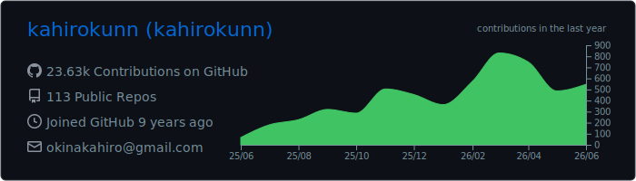
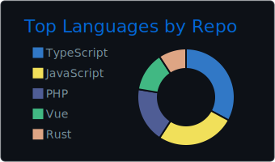
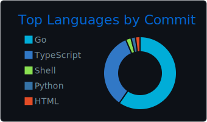
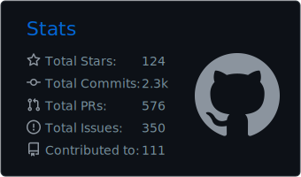
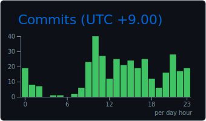

*Building scalable applications and cloud-native solutions*

## 🏆 Top Projects I've Contributed To

<!-- CONTRIB-PROJECTS:START -->

<!-- CONTRIB-PROJECTS:END -->

## 🤝 Open Source Involvement

### Community Ambassador

**Sveltos Community Ambassador** (2025)
*Recognized for contributions to the Sveltos project and Kubernetes multi-tenancy ecosystem*

### 🌟 CNCF Contributions

<!-- CNCF_RANKING_START -->
**[#7 Top CNCF Contributor in Japan](https://all.devstats.cncf.io/d/66/developer-activity-counts-by-companies?orgId=1&var-period_name=Last%20year&var-country_name=Japan&var-repogroup_name=All&var-metric=contributions&var-companies=All)** (Last Year)
*Ranked 7th among all developers in Japan contributing to CNCF projects*
<!-- CNCF_RANKING_END -->

<!--
Note: This ranking is updated periodically.
Future automation: Planning to implement automatic updates using GitHub Actions.
Last checked: 2026-06
-->

### 🔍 Reviewer Roles

### 🧩 Maintainer Roles

## 🛠️ Tech Stack

### Languages

### Frontend

### Backend

### Infrastructure

### Tools

## 📊 GitHub Stats

## 📈 Profile Summary

## 📫 Connect with me

*Thanks for visiting my profile! Have a great day! 😊*

