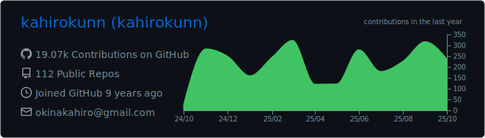
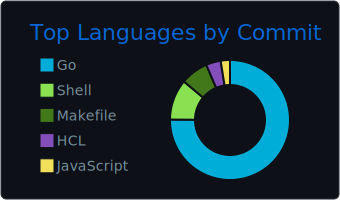
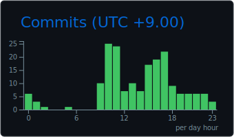

# Hi there, I'm kahirokunn 👋

*Passionate about building scalable web applications and cloud-native solutions*

## 🏆 Top Projects I've Contributed To

<!-- CONTRIB-PROJECTS:START -->

<!-- CONTRIB-PROJECTS:END -->

## 🛠️ Tech Stack

### Languages

### Frontend

### Backend

### Infrastructure & DevOps

### Tools

## 📊 GitHub Stats

## 📈 Profile Summary

## 📫 Connect with me

*Thanks for visiting my profile! Have a great day! 😊*

